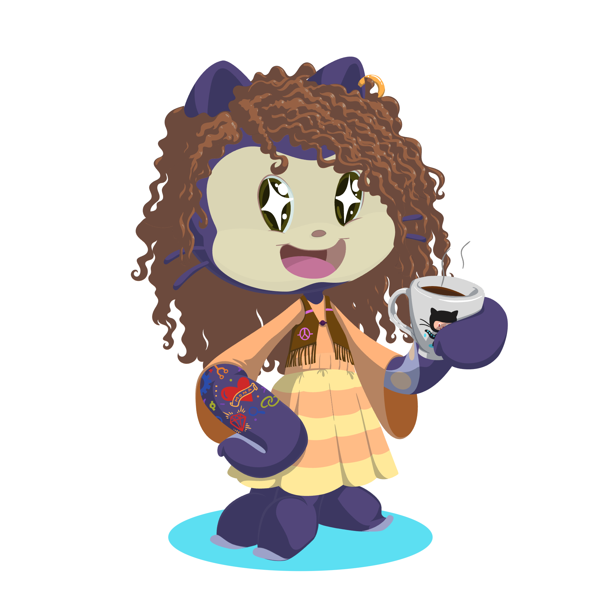

README
================

## \### Hi, I’m Heidi

<div class="columns">

<div class="column" width="40%">

``` r
heidi::about_me(
  pronouns = c("she", "her"),
  code =  c("R", "Python", "CSS", "Observable"),
  research_interests = c("Pharmacogenomics", "Precison Medicine", "Reproducibility in Clinical Research")
)
```

</div>

<div class="column" width="60%">



</div>

</div>

\<!--

\*\*hidyverse/hidyverse\*\* is a ✨ \_special\_ ✨ repository because
its \`README.md\` (this file) appears on your GitHub profile.

Here are some ideas to get you started:

\- 🔭 I’m currently working on …

\- 🌱 I’m currently learning …

\- 👯 I’m looking to collaborate on …

\- 🤔 I’m looking for help with …

\- 💬 Ask me about …

\- 📫 How to reach me: …

\- 😄 Pronouns: …

\- ⚡ Fun fact: …

--\>
